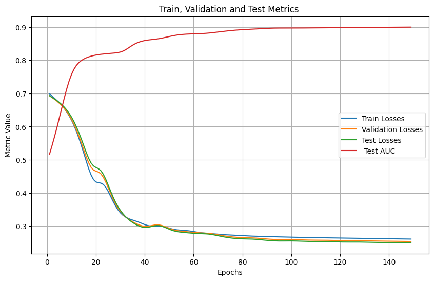

<h2>Spotify Playlist Recommender System</h2>
A Spotify playlist recommender System for automatic playlist continuation using Graph Neural Networks 
<h3> Heterogeneous graph data preperation</h3>
- A heterogenous graph is constructed using a subset of the  Spotify million playlist Dataset. 
- The graph contains playlist, tracks and artist nodes. 
- There are multiple edge types that connect different types of nodes. 
- Negative sampling of nodes is done to prevent all the node embeddings from being the same, i.e this enables the model to learn that
the playlist is more like(contains) song A and is different(does not contain) song B. 
<h3>Heterogeneous Graph transformer Model</h3>
- A Heterogeneous Graph Transformer is used to update node embeddings by aggregating node features from neighboring nodes. 
- Finally to predict whether a link is present between two nodes, an inner product is done between the node embeddings to find how similar they are. 
- Bayesian Personalized ranking which takes into account both the positive and negative predictions is used to train the network.
<h3>Results</h3>
The model shows good performance acheiving an AUC of 0.9 and Recall of 0.74 

